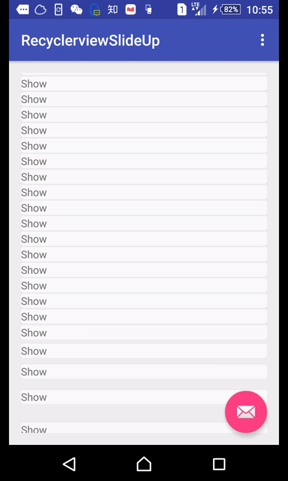

# RecyclerviewSlideUp
Add slide up animation to Recyclerview items. Try to behave like Google+ animation

# Concept
I try to make slide up/in animation for Recyclerview items just like Google+. At first I use translationY, which leads to some bugs such as misplacement.
My solution is add a space view above the Recyclerview item to occupy space. By animating the space view's padding, the animation works fine while flipping.

# Demo


# Todo
1. Improve code and add doc
2. Add generic to some method
3. Extends the animating type

# Usage
Extends SlideUpAdapter and BaseViewHolder as showed in app sample
```
//Set px for slide up animation 
setSlideUpPx(int px)

public class MySlideUpAdapter extends SlideUpAdapter {
    @Override
    public int getItemCount() {
        return 100;
    }
    //return your own holder
    @Override
    protected BaseViewHolder onCreateViewHolder(View itemView) {
        return new MyHolder(itemView);
    }
    //return your item view
    @Override
    public View onCreateView(LinearLayout parent, int viewType) {
        return LayoutInflater.from(parent.getContext()).inflate(R.layout.item_rv,parent,false);
    }
    //onBindHolder
    @Override
    protected void onBindBaseHolder(BaseViewHolder holder, int position) {
        MyHolder myHolder= (MyHolder) holder;
        myHolder.tv.setText("Show");
    }
    //extends BaseViewHolder
    public static class MyHolder extends BaseViewHolder{
        public TextView tv;
        public MyHolder(View itemView) {
            super(itemView);
            tv= (TextView) itemView.findViewById(R.id.tv_item);
        }
    }
}
```
# License


    Copyright 2015 kirsting

    Licensed under the Apache License, Version 2.0 (the "License");
    you may not use this file except in compliance with the License.
    You may obtain a copy of the License at

       http://www.apache.org/licenses/LICENSE-2.0

    Unless required by applicable law or agreed to in writing, software
    distributed under the License is distributed on an "AS IS" BASIS,
    WITHOUT WARRANTIES OR CONDITIONS OF ANY KIND, either express or implied.
    See the License for the specific language governing permissions and
    limitations under the License.
